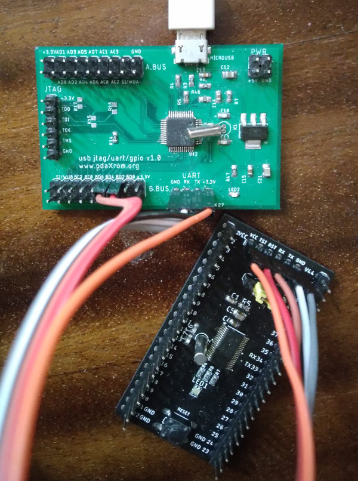
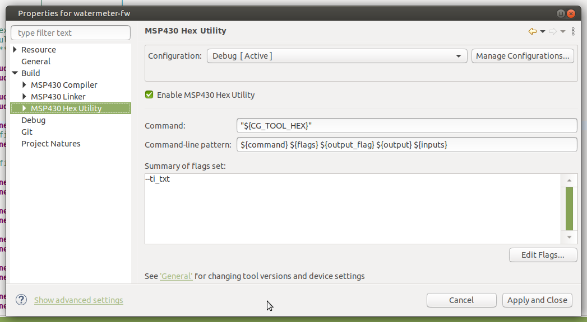

# SERIAL-BSL-MSP430FR-FLASHER
MSP430FR Serial BSL programmer for Linux

The programmer is based on the original source code TI UART_BSL_MSP430FR_Command_Line_Utility and adapted 
to work with a serial port in Linux. Additional signals from the serial port are used to control the RESET and TEST lines.

Running the utility:

./msp430fr-flasher <reset pin> <test pin> <uart device> <firmware>

Example of use (MCU pin RESET connected to serial DTR pin, MCU pin TEST to RTS):

./msp430fr-flasher 2 4 /dev/ttyUSB1 firmware/Debug/watermeter-fw.txt

Serial port control line numbering can be found in /usr/include/asm-generic/termios.h

The utility uses the firmware in the TI TXT HEX format. To generate it in the project properties enable MSP430 Hex Utility and add to summary flags set --ti_txt

